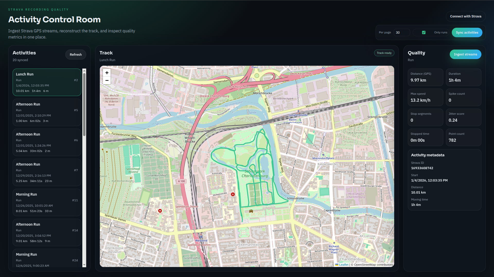

# Strava Recording Quality
**Strava GPS Recording Quality & Geospatial Analysis**

Strava Recording Quality is a compact, end-to-end system for **ingesting Strava GPS streams**, **reconstructing tracks**, and **analyzing recording quality**. It stores raw points in **PostgreSQL + PostGIS**, then computes interpretable metrics like distance, max speed, spikes, stops, and jitter.



## What this project is
Fitness activities are recorded under noisy real-world conditions:
- GPS jitter and signal loss
- teleport jumps ("spikes")
- false or missing pauses
- irregular sampling intervals
- device variability

This project demonstrates a production-minded pipeline to:
- ingest raw GPS data from Strava
- store it natively as geospatial data
- rebuild clean tracks
- compute quality signals you can act on

## Features
- **Strava OAuth authentication**
- **Activity metadata ingestion** with idempotent upserts
- **Raw GPS stream ingestion** into PostGIS (point-level storage)
- **Track reconstruction** as GeoJSON LineStrings
- **Recording-quality metrics** (distance, max speed, spikes, stops, jitter)
- **Modern web UI** for activity selection, track view, and quality report

## Architecture
**Backend**
- FastAPI
- SQLAlchemy + Alembic
- PostgreSQL + PostGIS
- GeoAlchemy2 + Shapely
- httpx (Strava API client)

**Frontend**
- React + Vite
- Leaflet + React-Leaflet

## Repository structure
```
strava-recording-quality/
├── backend/
│   ├── app/
│   │   ├── core/
│   │   ├── integrations/
│   │   ├── models/
│   │   ├── routes/
│   │   ├── services/
│   │   ├── schemas/
│   │   └── static/
│   │       └── demo.html
│   ├── alembic/
│   ├── alembic.ini
│   ├── requirements.txt
│   └── .env.example
├── infra/
│   └── docker-compose.yml
└── web/
    ├── src/
    └── package.json
```

## Quickstart
**Prerequisites**
- Docker + Docker Compose
- Python 3.11+
- Node 18+
- Strava developer account

### 1) Start Postgres + PostGIS (and Redis)
```bash
docker compose -f infra/docker-compose.yml up -d
```

### 2) Backend setup
```bash
cd backend
python -m venv .venv
source .venv/bin/activate
pip install -r requirements.txt
```

### 3) Configure environment variables
```bash
cp .env.example .env
```
Fill in:
- `STRAVA_CLIENT_ID`
- `STRAVA_CLIENT_SECRET`

In your Strava developer app settings:
- Authorization Callback Domain: `127.0.0.1`
- Redirect URI: `http://127.0.0.1:8000/auth/strava/callback`

### 4) Run database migrations
```bash
PYTHONPATH=. alembic upgrade head
```

### 5) Start the API
```bash
uvicorn app.main:app --reload --port 8000
```
Swagger UI: `http://127.0.0.1:8000/docs`

### 6) Start the web UI
```bash
cd web
npm install
npm run dev
```
Open `http://127.0.0.1:5173`.

> The Vite dev server proxies `/auth`, `/sync`, and `/activities` to the FastAPI backend.
> If you deploy the UI separately, set `VITE_API_BASE` to your API URL.

## Typical usage flow
1. Authenticate with Strava:
```
http://127.0.0.1:8000/auth/strava/login
```

2. Sync activities:
```bash
curl -X POST "http://127.0.0.1:8000/sync/activities?per_page=30"
```

3. Pick an activity:
```bash
curl "http://127.0.0.1:8000/activities?limit=5"
```

4. Ingest GPS streams:
```bash
curl -X POST "http://127.0.0.1:8000/activities/<id>/ingest_streams"
```

5. Inspect results:
```bash
curl "http://127.0.0.1:8000/activities/<id>/track"
curl "http://127.0.0.1:8000/activities/<id>/quality"
```

## API endpoints
**Auth**
```
GET /auth/strava/login
GET /auth/strava/callback
```

**Ingestion**
```
POST /sync/activities
POST /activities/{activity_id}/ingest_streams
```

**Analysis**
```
GET /activities/{activity_id}/track
GET /activities/{activity_id}/quality
```

## Example output
```json
{
  "activity_id": 2,
  "sport_type": "Run",
  "distance_m_gps": 9968.43,
  "duration_s": 3886,
  "max_speed_kmh": 13.24,
  "spike_count": 0,
  "stop_segments": 0,
  "jitter_score": 0.24
}
```

## Design notes
- Point-level storage preserves sampling irregularities and makes signal analysis explicit.
- PostGIS-native geometry enables accurate spatial analysis and indexing.
- Metrics are interpretable and easy to extend into ML models.

## Possible extensions (out of scope by design)
- Sport-specific quality thresholds
- Kalman or spline smoothing
- Map matching to road graphs
- Streaming ingestion
- ML-based anomaly classification
