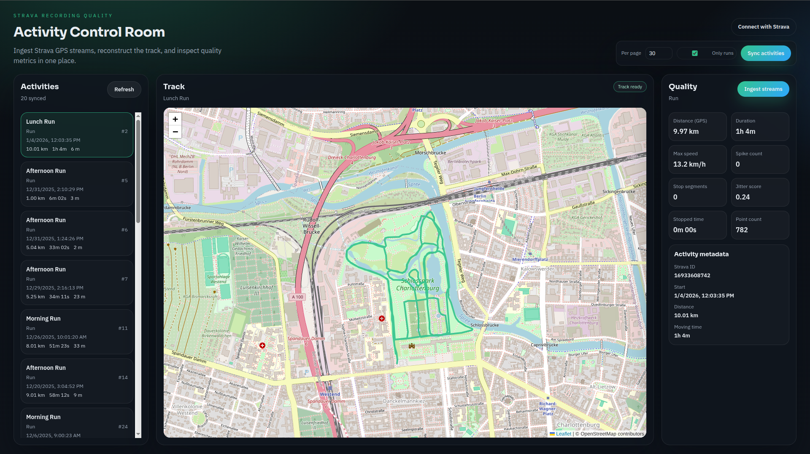
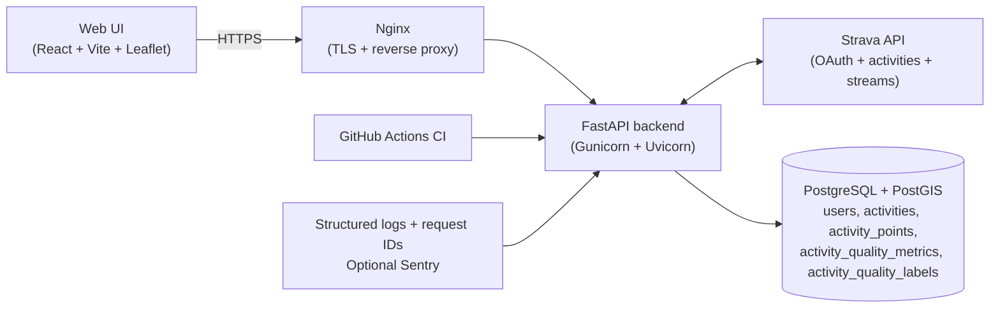

# Strava Recording Quality

Strava Recording Quality is an end-to-end backend + web system for:
- ingesting Strava activities and GPS streams,
- storing point-level geospatial data in PostgreSQL/PostGIS,
- computing recording-quality metrics,

## Live Deployment
- App: [https://api.michalszczepanski.com/](https://api.michalszczepanski.com/)
- API docs: [https://api.michalszczepanski.com/docs](https://api.michalszczepanski.com/docs)
- Health: [https://api.michalszczepanski.com/health](https://api.michalszczepanski.com/health)

## Architecture

```mermaid
flowchart LR
  UI["Web UI<br/>(React + Vite + Leaflet)"] -->|HTTPS| NGINX["Nginx<br/>(TLS + reverse proxy)"]
  NGINX --> API["FastAPI backend<br/>(Gunicorn + Uvicorn)"]
  API <--> STRAVA["Strava API<br/>(OAuth + activities + streams)"]
  API --> DB[("PostgreSQL + PostGIS<br/>users, activities, activity_points,<br/>activity_quality_metrics, activity_quality_labels")]
  CI["GitHub Actions CI"] --> API
  OBS["Structured logs + request IDs<br/>Optional Sentry"] --> API
```
